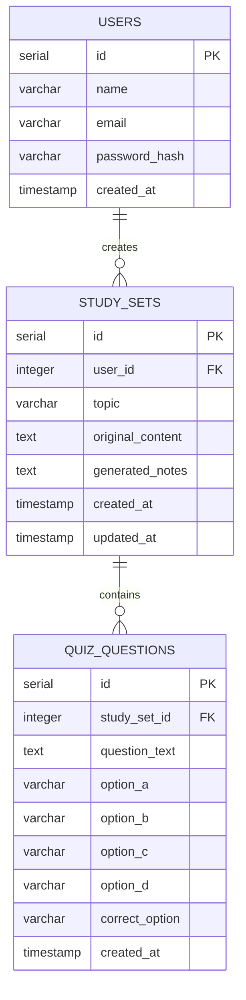

# StudyMate Database Design

## Entity-Relationship Diagram

## Relationships

- One user has many study sets (`study_sets.user_id` references `users.id`, `ON DELETE CASCADE`)
- One study set has many quiz questions (`quiz_questions.study_set_id` references `study_sets.id`, `ON DELETE CASCADE`)
- `quiz_questions` is schema-only; not yet populated by the application (see README, Known Limitations)

Full column definitions and constraints: `config/schema.sql`.